# 基于Django的音乐网站开发笔记

创建项目：

```bash
django-admin startproject 项目名
```

创建完的的仓库可以看一下文件结构

```bash
tree .
.
|-- 项目名
|   |-- __init__.py
|   |-- asgi.py
|   |-- settings.py
|   |-- urls.py
|   `-- wsgi.py
`-- manage.py
```

做一个好习惯，每个项目都用`git`来维护

```bash
git init // 将当前文件夹设置为git仓库
```

然后要进行云端仓库的连接，这里以AcWing的GitLab为例

首先我们要创建一个空白仓库，然后选择导入自己现有的仓库，接下来开始仓库的初始化配置

```bash
git config --global user.name "Day light"
git config --global user.email "1661434401@qq.com"
```

GitHub的是

```bash
git config --global user.name "Daylight131989"
git config --global user.email "uwwo2931@gmail.com"
```

当你把项目中的文件add和commit之后，接下来就

```bash
git remote add origin git@git.acwing.com:Daylight131989/webmusic.git
```

GitHub的是

```bash
git remote add origin https://github.com/Daylight131989/WebMusic.git
```

再接下来

```bash
git push --set-upstream origin master
```

这样你的第一个初始云端仓库就创建好了。

------

接下来就可以运行一下我们的Django项目了

```bash
python3 manage.py runserver 0.0.0.0:8000 // 后面的8000可替换成你自定义的调试端口
```

此时你会遇到一个问题，那就是你不可以使用这个端口，这个问题的原因是你没有在allowhost中加入这个ip这个端口，Django不会让你打开的。

所以你需要干的是去/项目名/项目名/settings.py这个文件中的

```python
ALLOWED_HOSTS = []
```

小技巧：不知道这个东西在哪的时候可以输入指令

```bash
ag ALLOWED_HOSTS
```

就可以全文搜索这个字符串。

然后改成你的IP，用字符串写

```python
ALLOWED_HOSTS = ["182.92.82.179"]
```

然后再运行一下就可以看到下面的画面

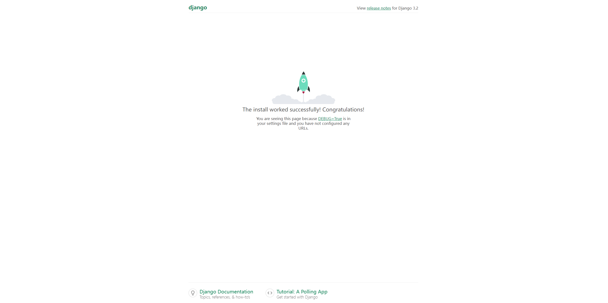

当你`git status`一下后会发现，存在一个名为`__pycache__`的文件夹，这个文件夹是python预编译好的，是加速代码的，并不是我们的源代码，所以我们上传仓库的时候尽量要避免上传这样的中间文件，会污染我们源代码，所以我们接下来可以这样做。

我们可以在仓库的根目录创建一个文件叫`.gitignore`

然后在里面写上

```
*/__pycache__
```

这样做完之后再`git status`就会发现这个文件不会add到我们的工作区了。

------

这个是Django的默认界面，我们当然不能在这个页面下写自己的页面。

在Django中有一个app的概念，我们现在要创建一个app

```bash
python3 manage.py startapp 你想要创建的app的名字

musicpage
	|-- __init__.py
    |-- admin.py // 用来存储管理员页面
    |-- apps.py
    |-- migrations // 系统生成的
    |   `-- __init__.py
    |-- models.py // 用来定义我们自己网站里的各种数据库表的
    |-- tests.py
    `-- views.py // 写视图的，也就是写函数的
```

------

此时我们可以进入我们的管理员页面看一下

在浏览器中输入：你的IP:8000/admin

但大概率的你打开的页面是个报错信息，这是因为需要将数据库里的内容更新一下，当你启动Django项目的时候，你会发现出现一行红色的警告，他的意思是你有多少个数据库的修改没有同步到我们的数据库里。


此时你可以输入以下指令来进行同步

```bash
python3 manage.py migrate
```

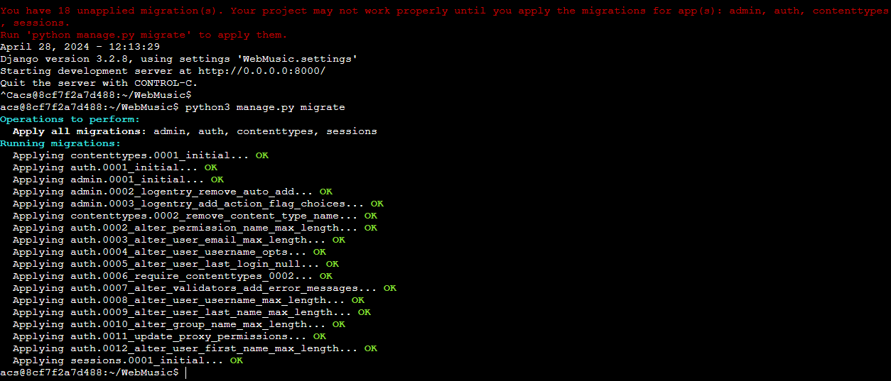

这就意味着你已经同步成功了

此时你去打开你的admin页面就会是这样的

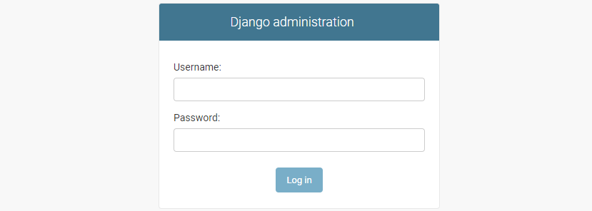

为了能够登录这个管理员页面，我们需要创建一个管理员账号。

```
python3 manage.py createsuperuser
```

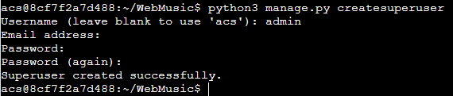

先是输入你想要创建的管理员的名称，其次是邮箱（可以不填），然后就是密码了。

这样我们就可以进入管理员页面了。

------

那么我们如何创建自己的页面呢。

其中最关键的三个文件：`models.py` `views.py` `urls.py` 

我们需要创建一个`urls.py`和一个`templates`文件夹。

```
// 在app的文件夹下
touch urls.py
mkdir templates
```

其中如果业务量小，`models`、`views`和`urls`可以是文件，业务量多了可以变成文件夹拆分成更细的模块，但`templates`必须是文件夹。

`models`：存我们的数据结构，也就是`class`之类的。

`views`：存我们的视图，也就是函数。我们每进行一次操作都是在后端实现的，那么执行这些操作的函数都存在这里。

`urls`：其实是路由，每点一个内容的话，他传的是我们的地址。根据`urls`的格式来判断我们该调用哪个函数。

`templates`：用来存我们的html文件

------

我们可先在`views.py`里写一个最简单的函数。

**views.py**

```python
from django.http import HttpResponse

def index(request): # 每一个从前端过来的页面都会有一个request，会存我们很多的页面信息
 return HttpResponse("我的第一个网页！！！！") #返回一个字符串
```

写完这个我们需要路由一下，我们去`musicpage`文件夹下的`urls.py`中写一下路由（可以照`WebMusic`下的`urls.py`抄）

**musicpage/urls.py**

```python
from django.urls import path
from musicpage.views import index # python调包过程，在哪个文件中调用哪个函数

urlpatterns = [
    path('', index, name="index"), # path是一个解析的过程，
]
```

当写完这个之后，还需要在`WebMusic`下的`urls.py`中`include`进来

**WebMusic/urls.py**

```python
from django.contrib import admin
from django.urls import path, include # 这里include

urlpatterns = [
    path('musicpage/', include('musicpage.urls')), #这里include
    path('admin/', admin.site.urls),
]
```

一般的话，如果只有一个app的话，就不需要写第5行单引号里的地址了，直接就默认打开这个页面

整个过程相当于一个接力：

1. 用户的请求（输入当前的网址）
2. 先走到`WebMusic`下的`urls.py`
3. 从`WebMusic`里的`urls.py`走到`musicpage`里的`urls.py`
4. 从`musicpage`里的`urls.py`走到`views.py`中的`index`函数，我们在这个函数里些什么用户就会看到什么

------

### 1. 配置环境

修改musicpage/settings.py

```python
INSTALLED_APPS = [
    'django.contrib.admin',
    'django.contrib.auth',
    'django.contrib.contenttypes',
    'django.contrib.sessions',
    'django.contrib.messages',
    'django.contrib.staticfiles',
    'musicpage'
]
```

#### **配置数据库**

在musicpage/settings.py中的DATABASES进行修改

```python
DATABASES = {
    'default': {
        'ENGINE': 'django.db.backends.mysql',
        'NAME': 'WebMusic',
        'USER': 'root',
        'PASSWORD': 'Mty030726',
        'HOST': '182.92.82.179',
        'PORT': '3306'
    }
}
```

#### **设置pymysql库引用**

在WebMusic目录下__init.py文件顶部增加：

```python
import pymysql
pymysql.install_as_MySQLdb()
```

这里需要`pymysql`库来连接数据库：

安装命令如下：

```
pip install pymysql
```

#### **创建数据库**

创建数据库WebMusic，选择utf8mb4。

#### **创建数据表**

#### **生成表迁移文件**

命令行执行：

```python
python3 manage.py makemigrations
```

#### **执行表迁移**

```python
python3 manage.py migrate
```

这时候数据库会出现django默认配置的一些表。

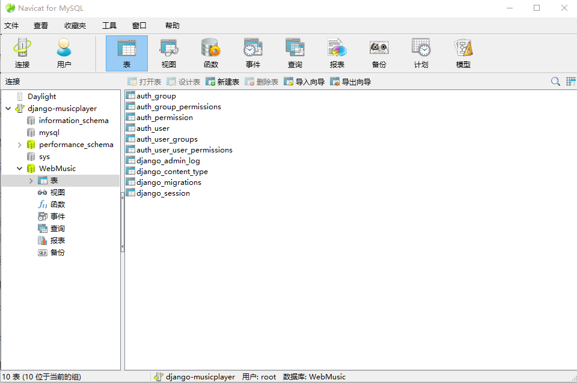

#### **后台管理**

因为网站数据添加，所以需要先添加一些数据，这部分数据添加可以用django原生后台来操作。

#### **配置时区**

配置时区：将其修改为中国上海时区

```
TIME_ZONE = 'UTC'
```

改为

```
TIME_ZONE = 'Asia/Shanghai'
```

#### **配置语言**

配置语言：将其修改为简体中文

```
LANGUAGE_CODE = 'en-us'
```

改为

```
LANGUAGE_CODE = 'zh-hans'
```

效果：

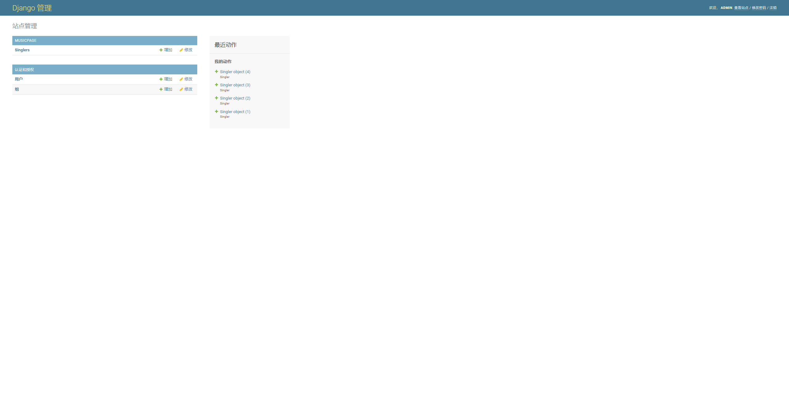

####  **总结**

本篇主要内容为网站开发环境配置和使用django后台管理。

------

### 2. 后台歌手表模块开发

#### 表结构设计

歌手表（singer）结构

| 字段          | 类型         | 注释        |
| ------------- | ------------ | ----------- |
| id            | int(11)      | 歌手表id    |
| name          | varchar(50)  | 用户名      |
| pinyin        | varchar(50)  | 名称拼音    |
| portrait      | varchar(200) | 头像链接    |
| first_letter  | varchar(15)  | 名称首字母  |
| gender        | tinyint(2)   | 性别0女 1男 |
| birthday      | varchar(20)  | 生日        |
| height        | int(4)       | 身高(cm)    |
| weight        | int(3)       | 体重(kg)    |
| constellation | varchar(50)  | 星座        |
| singe_num     | int(11)      | 单曲数      |
| album_num     | int(11)      | 专辑数      |
| desc          | text(0)      | 简介        |
| addtime       | int(11)      | 添加时间    |
| updatetime    | int(11)      | 编辑时间    |

#### **创建表模型**

在musicpage工程目录下的models.py中创建歌手表模型。

```python
from django.db import models
from datetime import date, datetime
 
 
# Create your models here.
class Singler(models.Model):
    """ 歌手表模型 """
 
    name = models.CharField(max_length=50, help_text='请输入歌手名称')
    first_letter = models.CharField(max_length=15, help_text='请输入歌手名称首字母')
    # 设置上传位置
    portrait = models.ImageField(upload_to='uploads/%Y%m%d%H/', help_text='请上传歌手照片')
    birthday = models.DateField(default=date.today, help_text='请选择歌手生日')
    height = models.IntegerField(help_text='请输入歌手身高（cm）', default=0, blank=True)
    weight = models.IntegerField(help_text='请输入歌手体重（kg）', default=0, blank=True)
    constellation = models.CharField(max_length=50, help_text='请输入歌手星座')
    singe_num = models.IntegerField(default=0)
    album_num = models.IntegerField(default=0)
    desc = models.TextField(help_text='请输入歌手简介')
    addtime = models.DateTimeField(auto_now_add=True)
    updatetime = models.DateTimeField(auto_now=True)
```

#### 配置介绍

静态资源是指项目配置的js/css/image等系统常用文件。对于一些经常变动的资源，通常放在媒体资源文件夹，比如歌手头像、歌单封面、专辑封面等。

媒体资源和静态资源是可以同时存在的，两者独立运行，互不影响。

#### 设置媒体资源

媒体资源需要配置属性MEDIA_URL和MEDIA_ROOT。

需要注意：媒体资源路径不可与静态资源路径相同。

#### **设置图片上传路径**

在WebMusic/settings.py中最下方设置。

```python
# 设置文件上传位置
MEDIA_URL = '/media/'

MEDIA_ROOT = os.path.join(BASE_DIR, 'media')
```

#### **创建上传文件目录**

在WebMusic目录下创建media文件夹。

#### **注册媒体资源路由**

配置属性设置后，为媒体文件夹media添加相应的路由地址，

否则无法在浏览器中访问该文件夹的文件信息。

在Webmusic/urls.py中设置。

```python
from django.contrib import admin
from django.urls import path, re_path
from django.views.static import serve
from django.conf import settings
 
urlpatterns = [
    path('admin/', admin.site.urls),
    re_path('media/(?P<path>.*)', serve, {'document_root': settings.MEDIA_ROOT}, name='media'),
]
```

#### **生成表迁移**

```bash
python3 manage.py makemigrations
```

#### **执行创建表**

```python
python3 manage.py migrate
```

创建表结构如下：

```sql
CREATE TABLE `player_singler` (
  `id` bigint(20) NOT NULL AUTO_INCREMENT,
  `name` varchar(50) NOT NULL,
  `first_letter` varchar(15) NOT NULL,
  `portrait` varchar(100) NOT NULL,
  `birthday` date NOT NULL,
  `height` int(11) NOT NULL,
  `weight` int(11) NOT NULL,
  `constellation` varchar(50) NOT NULL,
  `singe_num` int(11) NOT NULL,
  `album_num` int(11) NOT NULL,
  `desc` longtext NOT NULL,
  `addtime` datetime(6) NOT NULL,
  `updatetime` datetime(6) NOT NULL,
  PRIMARY KEY (`id`)
) ENGINE=MyISAM DEFAULT CHARSET=utf8mb4;
```

#### **后台管理表模型**

在player目录下admin.py中注册歌手表模型到后台。

```python
from django.contrib import admin
from .models import Singler


# Register your models here.

class SinglerAdmin(admin.ModelAdmin):
    pass


admin.site.register(Singler, SinglerAdmin)
```

#### **歌手表模型操作**

**新增**

点击表模型旁边增加按钮，即可进入新增界面，增加一条新的歌手记录。

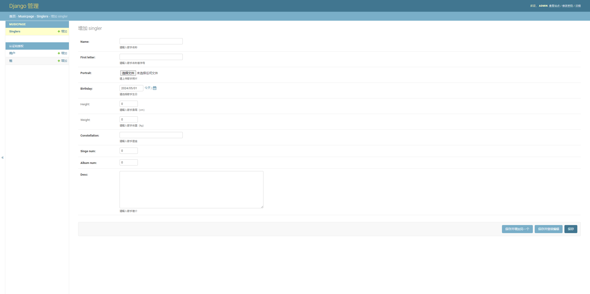

**编辑、删除**

通过表模型数据列表，点击进入歌手数据详情。

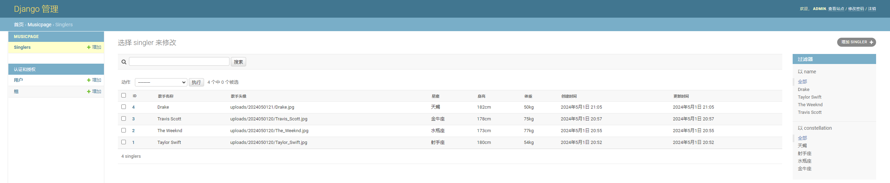

 歌手数据详情可编辑，也可点击下方删除按钮，删除数据。

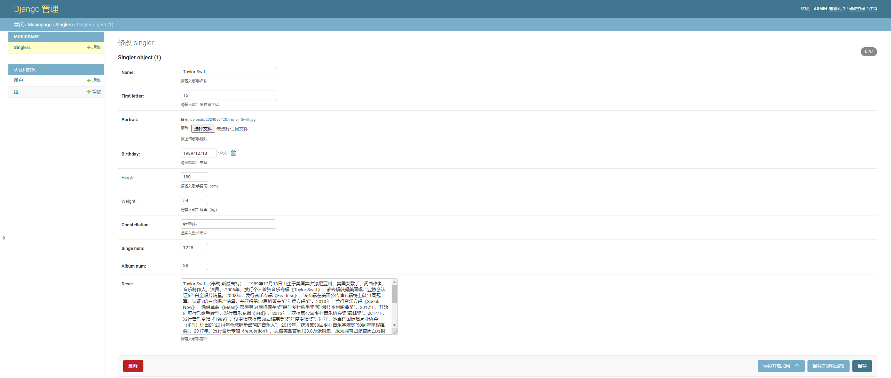

**优化歌手记录列表**

修改musicpage/admin.py。

```python
from django.contrib import admin
from .models import Singler


# Register your models here.
class SinglerAdmin(admin.ModelAdmin):
    
    # 列表页属性
    def get_name(self):
        return self.name
    get_name.short_description = '歌手名称'
 
    def get_portrait(self):
        return self.portrait
    get_portrait.short_description = '歌手头像'
 
    def get_constellation(self):
        return self.constellation
    get_constellation.short_description = '星座'
 
    def get_height(self):
        return str(self.height) + 'cm'
    get_height.short_description = '身高'
 
    def get_weight(self):
        return str(self.weight) + 'kg'
    get_weight.short_description = '体重'
 
    def get_addtime(self):
        return self.addtime
    get_addtime.short_description = '创建时间'
 
    def get_updatetime(self):
        return self.updatetime
    get_updatetime.short_description = '更新时间'
 
    # 显示字段
    list_display = ['id', get_name, get_portrait, get_constellation, get_height, get_weight, get_addtime, get_updatetime]
    # 过滤器
    list_filter = ['name', 'constellation']
    # 搜索
    search_fields = ['name', 'constellation']
    # 分页
    list_per_page = 5


admin.site.register(Singler, SinglerAdmin)
```

**总结**

在django中数据表到后台操作顺序为：

创建表模型->创建表迁移文件->执行表迁移->后台注册。

优化就是后台自定义管理；

比较麻烦的就是，所有表操作修改都需要创建和执行表迁移。

------

### 3. **后台单曲、专辑表模块开发**

#### 表结构设计

**单曲表（singe）结构**

| 字段       | 类型         | 注释         |
| ---------- | ------------ | ------------ |
| id         | int(11)      | 单曲id       |
| sid        | int(11)      | 所属歌手id   |
| aid        | int(11)      | 所属专辑id   |
| name       | varchar(50)  | 单曲名称     |
| duration   | int(11)      | 时长（ms）   |
| path       | varchar(200) | 歌曲文件链接 |
| lyric      | varchar(200) | 歌词文件链接 |
| addtime    | int(11)      | 发行时间     |
| updatetime | int(11)      | 编辑时间     |

**专辑表（album）结构**

| 字段       | 类型         | 注释       |
| ---------- | ------------ | ---------- |
| id         | int(11)      | 单曲id     |
| singler_id | int(11)      | 所属歌手id |
| name       | varchar(50)  | 专辑名称   |
| cover      | varchar(255) | 专辑封面   |
| desc       | varchar(255) | 专辑简介   |
| single_num | int(11)      | 单曲数     |
| lang       | varchar(50)  | 专辑语种   |
| addtime    | int(11)      | 创建时间   |
| updatetime | int(11)      | 更新时间   |

#### **创建表模型**

在musicpage工程目录下的models.py中创建表模型。

专辑和单曲表关系为多对多，需要设置一个中间关系表；在django中多对多关系，不需要主动设置，会自动创建一个隐藏中间表。

内容如下：

```python
class Singe(models.Model):
    """ 单曲表 """
 
    name = models.CharField(max_length=50, help_text='请输入单曲名称')
    duration = models.IntegerField(help_text='请输入歌曲时长（ms）')
    path = models.FileField(upload_to=upload_save_path, help_text='请上传歌曲')
    lyric = models.FileField(upload_to=upload_save_path, help_text='请上传歌曲单词')
    addtime = models.DateTimeField(auto_now_add=True)
    updatetime = models.DateTimeField(auto_now=True)
 
    # 设置与歌手表关联外键
    # 一对多外键设置在多的模型中
    singler = models.ForeignKey("Singler", on_delete=models.CASCADE)
 
 
class Album(models.Model):
    """ 专辑表 """
 
    name = models.CharField(max_length=50, help_text='请输入专辑名称')
    cover = models.ImageField(upload_to=upload_save_path, help_text='请上传专辑封面图')
    desc = models.CharField(max_length=255, help_text='请输入专辑描述')
    single_num = models.IntegerField(default=0, help_text='请输入单曲数')
    single_lang = models.CharField(max_length=50, help_text='请输入专辑语种')
    addtime = models.DateTimeField(auto_now_add=True)
    updatetime = models.DateTimeField(auto_now=True)
 
    # 设置与歌手表关联外键 一对多 级联删除
    singler = models.ForeignKey("Singler", on_delete=models.CASCADE)
 
    # 设置与单曲表关联外键 多对多
    Singe = models.ManyToManyField('Singe')
```

#### **创建表**

```bash
python3 manage.py makemigrations

python3 manage.py migrate
```

这两条命令执行结束后，数据库增加musicpage_album、musicpage_singe表及关系表musicpage_album_singe

表结构如下：

```sql
CREATE TABLE `player_album` (
  `id` bigint(20) NOT NULL AUTO_INCREMENT,
  `name` varchar(50) NOT NULL,
  `cover` varchar(100) NOT NULL,
  `desc` varchar(255) NOT NULL,
  `single_num` int(11) NOT NULL,
  `single_lang` varchar(50) NOT NULL,
  `addtime` datetime(6) NOT NULL,
  `updatetime` datetime(6) NOT NULL,
  `singler_id` bigint(20) NOT NULL,
  PRIMARY KEY (`id`),
  KEY `player_album_singler_id_cde08698` (`singler_id`)
) ENGINE=MyISAM DEFAULT CHARSET=utf8mb4;
 
CREATE TABLE `player_singe` (
  `id` bigint(20) NOT NULL AUTO_INCREMENT,
  `name` varchar(50) NOT NULL,
  `duration` int(11) NOT NULL,
  `path` varchar(100) NOT NULL,
  `lyric` varchar(100) NOT NULL,
  `addtime` datetime(6) NOT NULL,
  `updatetime` datetime(6) NOT NULL,
  `singler_id` bigint(20) NOT NULL,
  PRIMARY KEY (`id`),
  KEY `player_singe_singler_id_103f9b74` (`singler_id`)
) ENGINE=MyISAM DEFAULT CHARSET=utf8mb4;
 
CREATE TABLE `player_album_singe` (
  `id` bigint(20) NOT NULL AUTO_INCREMENT,
  `album_id` bigint(20) NOT NULL,
  `singe_id` bigint(20) NOT NULL,
  PRIMARY KEY (`id`),
  UNIQUE KEY `player_album_Singe_album_id_singe_id_5df36ff3_uniq` (`album_id`,`singe_id`),
  KEY `player_album_Singe_album_id_2148d063` (`album_id`),
  KEY `player_album_Singe_singe_id_f3856b29` (`singe_id`)
) ENGINE=MyISAM DEFAULT CHARSET=utf8mb4;
```

#### **后台注册表模型**

在musicpage目录下admin.py中注册单曲、专辑表模型到后台。

引入表

```python
from .models import Singe, Album
```

增加自定义上传文件路径方法设置。

```python
class SingeAdmin(admin.ModelAdmin):
    # 列表页属性
    def get_name(self):
        return self.name
    get_name.short_description = '歌曲名称'
    
    def get_duration(self):
        return self.duration
    get_duration.short_description = '歌曲时长'

    def get_addtime(self):
        return self.addtime
    get_addtime.short_description = '创建时间'

    def get_updatetime(self):
        return self.updatetime
    get_updatetime.short_description = '更新时间'

    # 显示字段
    list_display = ['id', get_name, get_duration, get_addtime, get_updatetime]
    # 过滤器
    list_filter = ['name']
    # 搜索
    search_fields = ['name']
    # 分页
    list_per_page = 5


class AlbumAdmin(admin.ModelAdmin):
    # 列表页属性
    def get_name(self):
        return self.name
    get_name.short_description = '专辑名称'

    def get_single_num(self):
        return self.singe_num
    get_single_num.short_description = '单曲数'

    def get_single_lang(self):
        return self.single_lang
    get_single_lang.short_description = '语种'

    def get_addtime(self):
        return self.addtime
    get_addtime.short_description = '创建时间'

    def get_updatetime(self):
        return self.updatetime
    get_updatetime.short_description = '更新时间'

    # 显示字段
    list_display = ['id', get_name, get_single_num, get_single_lang, get_addtime, get_updatetime]
    # 过滤器
    list_filter = ['name', 'single_lang']
    # 搜索
    search_fields = ['name', 'single_lang']
    # 分页
    list_per_page = 5
```


#### 后台首页轮播图表模块开发

**表结构设计**

| 字段 | 类型         | 注释     |
| ---- | ------------ | -------- |
| id   | int(11)      | 自增id   |
| path | varchar(100) | 图片路径 |
| href | varchar(100) | 跳转路径 |

#### **创建表模型**

自增id不需指定，默认自动添加。

```python
class Carousel(models.Model):
    """ 首页轮播图 """

path = models.ImageField(upload_to=upload_save_path, help_text='请选择上传首页轮播图')
href = models.CharField(max_length=100, help_text='请输入点击图片后跳转路径')
```

#### **创建表**

```bash
python manage.py makemigrations

python manage.py migrate
```

#### 后台注册表模型

在player/admin.py中添加轮播表模型，并注册。

#### 引入表模型

```python
from .models import Carousel
```

#### 后台自定义

```python
class CarouselAdmin(admin.ModelAdmin):

# 列表页属性

def get_path(self):
    return self.path

get_path.short_description = '图片路径'

def get_href(self):
    return self.href

get_href.short_description = '跳转路径'

# 显示字段

list_display = ['id', get_path, get_href]

 

admin.site.register(Carousel, CarouselAdmin)
```

**总结**

还是创建表模型到后台注册流程，增加了自定义上传文件设置，还有两种外键设置的方式：分别为一对多和多对多类型，其中一对多设置删除为级联方式，也就是删除一时多的一方也会被删除。

------

### 4. 配置媒体资源设置

#### **歌曲类型表结构**

| 字段 | 类型         | 注释                 |
| ---- | ------------ | -------------------- |
| id   | int(11)      | 自增id               |
| name | varchar(100) | 歌单名称             |
| pid  | int(11)      | 父类型id 0表明为父类 |

#### 歌单表结构

| 字段       | 类型         | 注释     |
| ---------- | ------------ | -------- |
| id         | int(11)      |          |
| name       | varchar(100) | 歌单名称 |
| cover      | varchar(100) | 封面路径 |
| playnum    | int(11)      | 播放量   |
| addtime    | int(11)      | 添加时间 |
| updatetime | int(11)      | 更新时间 |

#### **创建表模型**

还是在musicpage/models.py中添加。歌单表与类型表是多对多关系，中间表不需要创建，

只需要声明好关系，django会自动创建相应中间表。

内容如下：

```python
class SongCategory(models.Model):
    """ 歌曲类型表 """
 
    name = models.CharField(max_length=100, help_text='请输入类型名称')
    pid = models.IntegerField(default=0, help_text='父类型id')

class SongSheet(models.Model):
    """ 歌单表 """
 
    name = models.CharField(max_length=100, help_text='请输入歌单名称')
    cover = models.ImageField(upload_to=upload_save_path, help_text='请上传歌单封面图')
    playnum = models.IntegerField(default=0, help_text='请输入播放量')
    
    addtime = models.DateTimeField(auto_now_add=True)
    updatetime = models.DateTimeField(auto_now=True)
 
    # 歌曲类型与歌单表 多对多关系
    category = models.ManyToManyField('SongCategory')
 
    # 歌单表与单曲表多对多关系
    singe = models.ManyToManyField('Singe')
```

注意：可通过choices参数把输入框改为下拉菜单。

#### **创建表**

```bash
python3 manage.py makemigrations

python3 manage.py migrate
```

创建了四个表，分别为歌曲类型表、歌单表、歌单类型表、歌单单曲表；

歌曲类型表和歌单表结构与表结构设计相同，不再展示；

中间表结构如下：

```sql
CREATE TABLE `player_songsheet_singe` (
  `id` bigint(20) NOT NULL AUTO_INCREMENT,
  `songsheet_id` bigint(20) NOT NULL,
  `singe_id` bigint(20) NOT NULL,
  PRIMARY KEY (`id`),
  UNIQUE KEY `player_songsheet_singe_songsheet_id_singe_id_78f26d1c_uniq` (`songsheet_id`,`singe_id`),
  KEY `player_songsheet_singe_songsheet_id_2375e76e` (`songsheet_id`),
  KEY `player_songsheet_singe_singe_id_022e51d3` (`singe_id`)
) ENGINE=MyISAM DEFAULT CHARSET=utf8mb4;
 
 
CREATE TABLE `player_songsheet_category` (
  `id` bigint(20) NOT NULL AUTO_INCREMENT,
  `songsheet_id` bigint(20) NOT NULL,
  `songcategory_id` bigint(20) NOT NULL,
  PRIMARY KEY (`id`),
  UNIQUE KEY `player_songsheet_categor_songsheet_id_songcategor_d9f0af95_uniq` (`songsheet_id`,`songcategory_id`),
  KEY `player_songsheet_category_songsheet_id_80b16cc8` (`songsheet_id`),
  KEY `player_songsheet_category_songcategory_id_397ab572` (`songcategory_id`)
) ENGINE=MyISAM DEFAULT CHARSET=utf8mb4;
```

可以看出中间表字段关系与设计相符，并且相应索引都已经创建。

#### **后台注册表模型**

在musicpage/admin.py中操作。

#### **引入表模型**

```python
from .models import SongCategory, SongSheet
```

#### **后台自定义**

修改默认的显示、过滤、搜索、分页。

```python
class SongCategoryAdmin(admin.ModelAdmin):
 
    def get_name(self):
        return self.name
 
    get_name.short_description = '类型名称'
 
    def get_pid(self):
        return self.pid
 
    get_pid.short_description = '类型父id'
 
    # 显示字段
    list_display = ['id', get_name, get_pid]
    # 过滤器
    list_filter = ['name']
    # 搜索
    search_fields = ['name']
    # 分页
    list_per_page = 10
 
 
class SongSheetAdmin(admin.ModelAdmin):
 
    def get_name(self):
        return self.name
 
    get_name.short_description = '类型名称'
 
    def get_cover(self):
        return self.cover
 
    get_cover.short_description = '歌单封面'
 
 
    def get_addtime(self):
        return self.addtime
 
    get_addtime.short_description = '创建时间'
 
    def get_updatetime(self):
        return self.updatetime
 
    # 显示字段
    list_display = ['id', get_name, get_cover]
    # 过滤器
    list_filter = ['name']
    # 搜索
    search_fields = ['name']
    # 分页
    list_per_page = 10
 
admin.site.register(SongCategory, SongCategoryAdmin)
admin.site.register(SongSheet, SongSheetAdmin)
```

**总结**

表结构的设计和创建，包括后台注册操作起来大致相同，多创建一些表熟练了就简单了；

至此数据表设计和创建基本完成，下一步就是数据添加和后台使用优化了。

------

### 5. 后台歌手功能优化及表模型名称修改、模型继承内容

#### **表模型名称修改**

如果要自定义这个名称，可以在Model的Meta中声明：

```python
class Singler(models.Model):
    """ 歌手表模型 """
 
    class Meta:
        verbose_name = '歌手'
        verbose_name_plural = '歌手'
```

效果：

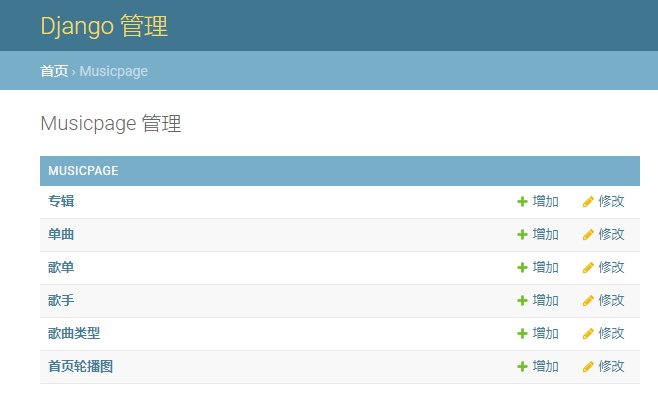

然后把其他表模型都改一下名称，就不再详述。

#### **模型继承**

创建一个[抽象基类](https://so.csdn.net/so/search?q=抽象基类&spm=1001.2101.3001.7020)，可以把其他数据模型的公共信息放入基类中；然后当这个抽象基类被其他模型类继承后，其字段会自动添加到子类中。

##### 创建抽象基类

```python
class BaseModel(models.Model):
    """ 设置基础模型类 """

addtime = models.DateTimeField(auto_now_add=True)
updatetime = models.DateTimeField(auto_now=True)

class Meta:
    abstract = True
```

##### 其他模型继承

歌手、单曲、专辑、歌单表模型继承基类模型，并去掉addtime、updatetime字段设定。

```python
class Singler(BaseModel):
class Singe(BaseModel):
class Album(BaseModel):
class SongSheet(BaseModel):
```

##### **更新表结构**

```bash
python manage.py makemigrations

python manage.py migrate
```

#### 歌手新增、编辑优化

##### 表字段名称修改

新增、编辑页面字段显示为数据表设计字段，改为中文显示。

在Model中直接修改Singler字段，增加verbose_name参数。

verbose_name（类型：Field.verbose_name）：admin模式中字段的显示名称。

内容如下：

```python
class Singler(BaseModel):
 
    class Meta:
        verbose_name = '歌手'
        verbose_name_plural = '歌手'

    name = models.CharField(max_length=50, help_text='请输入歌手名称', verbose_name = '姓名')
    first_letter = models.CharField(max_length=15, help_text='请输入歌手名称首字母', verbose_name = '姓名首字母')
    # 设置上传位置
    portrait = models.ImageField(upload_to=upload_save_path_singer_portrait, help_text='请上传歌手照片', verbose_name = '照片')
    birthday = models.DateField(default=date.today, help_text='请选择歌手生日', verbose_name = '生日')
    height = models.IntegerField(help_text='请输入歌手身高（cm）', default=0, blank=True, verbose_name = '身高(cm)')
    weight = models.IntegerField(help_text='请输入歌手体重（kg）', default=0, blank=True, verbose_name = '体重(kg)')
    constellation = models.CharField(max_length=50, help_text='请输入歌手星座', verbose_name = '星座')
    singe_num = models.IntegerField(default=0, editable = False)
    album_num = models.IntegerField(default=0, editable = False)
    desc = models.TextField(help_text='请输入歌手简介', verbose_name = '简介')
```

效果：

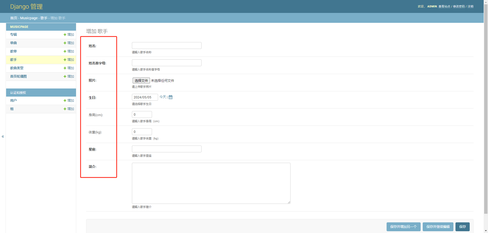

##### 隐藏单曲数和专辑数

歌手所拥有的单曲数和专辑数，应该是添加、删除单曲或专辑时动态计算出的数值，不应该是后台添加的，之前不会隐藏，经过查看表模型参数找到了设置方法。

editable（类型：Field.editable）：默认值为True（真）；

如果值为假，则在admin模式下不能改写。

修改歌手表模型单曲数和专辑数字段，设置editable参数。

内容如下：

```python
singe_num = models.IntegerField(default=0, editable=False)
album_num = models.IntegerField(default=0, editable=False)
```

刷新后，新增歌手详情单曲数和专辑数设置不再显示。

#### **姓名首字母**

原有姓名首字母需要自己手动输入，改为程序自动通过输入的歌手名称取得姓名首字母。

##### 安装xpinyin

需要下载三方库，安装命令：

```bash
pip install xpinyin
```

##### 获取姓名首字母

在musicpage/models.py中处理获取首字母并设置入库操作。

```
from xpinyin import Pinyin

def get_first_letter(name):
    """ 获取姓名中的首字母 """

obj = Pinyin()
name_pinyin = obj.get_pinyin(name, '')
return name_pinyin[0]
```

##### 重写保存方法

在Singler类中，重写父类保存方法，增加设置歌手姓名首字母。

并把首字母字段设置为admin不可编辑。（其实也可以可编辑，英文名字只保存第一个单词的首字母，中文歌手可以使用这个，禁止编辑随便）

```python
class Singler(models.Model):
    """ 歌手表模型 """
 
    ......
 
    def save(self, force_insert=False, force_update=False, using=None,
             update_fields=None):
        """ 重写save方法 """
 
        self.first_letter = get_first_letter(self.name)
        super().save()
```

#### **歌手列表页优化**

##### 将保存地址改成函数存储

在歌手类中加入这个函数

```python
def upload_save_path_singer_portrait(instance, filename):
        """ 上传文件保存路径 """
        # 获取当前日期并格式化为YYYYMMDD形式的字符串
        date_string = time.strftime("%Y%m%d", time.localtime())
        return 'uploads/singer_portrait/' + date_string + '/{0}'.format(filename)
```

然后把portrait改成这样

```python
portrait = models.ImageField(upload_to=upload_save_path_singer_portrait, help_text='请上传歌手照片', verbose_name = '照片')
```

其他需要保存的音频或者图片也按照这样做

##### **图片显示处理**

修改后台歌手表，在player中的admins.py中的SinglerAdmin。

需要使用format_html()函数。

##### 引入函数

```python
from django.utils.html import format_html
```

##### 路径改为显示图片

```python
class SinglerAdmin(admin.ModelAdmin):
 
    def get_portrait(self):
        return format_html(
            '',
            self.portrait,
        )
    get_portrait.short_description = '歌手头像'
```

一定要像我这样在前面加上`/media`，要不然会找不到地址的。

原因：django从view向template传递HTML字符串的时候，django默认不渲染此HTML，原因是为了防止这段字符串里面有恶意攻击的代码。所以要把列表的图片路径改为显示图片，需要使用函数，通过函数的{}占位符，把图片路径赋值给HTML元素img。

效果：

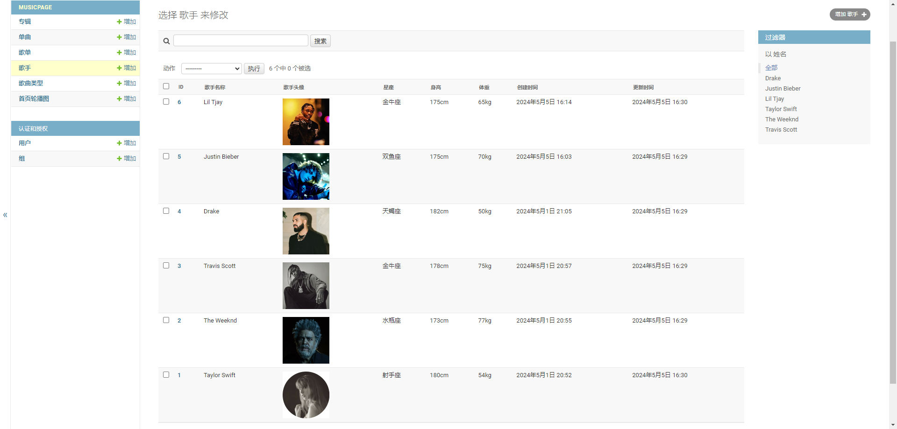

##### **修改列表默认设置**

适用于列表某字段为空时，设置显示内容。

比如歌手的身高体重都为默认0时。

内容如下：

```python
def get_height(self):
    if self.height < 1:
        return '——'
    else:
        return str(self.height) + 'cm'
 
get_height.short_description = '身高'
 
def get_weight(self):
    if self.weight < 1:
        return '——'
    else:
        return str(self.weight) + 'kg'
```

##### 修改列表排序

通过Meta类来给模型赋予元数据，设定ordering排序。

```python
class Singler(models.Model):
    """ 歌手表模型 """

class Meta:
    verbose_name = '歌手'
    verbose_name_plural = '歌手'

    # 正序

​    ordering = ['first_letter']

    # 倒序

    # ordering = ['-first_letter']
```

总结

本篇主要是在添加编辑过程中对后台歌手功能优化及表模型名称修改、模型继承内容。

### 6. 单曲原有功能的基础上进行部分功能实现和显示优化

#### **歌手下拉显示修改**

新增时选择歌手显示为对象，无法确认歌手。

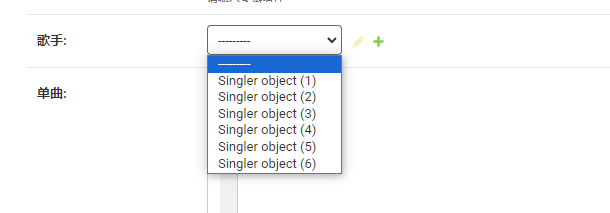

需修改Singler表模型，增加__str__方法

内容如下：

```python
def __str__(self):
    """ 修改返回格式 """
    return self.name
```

 效果：

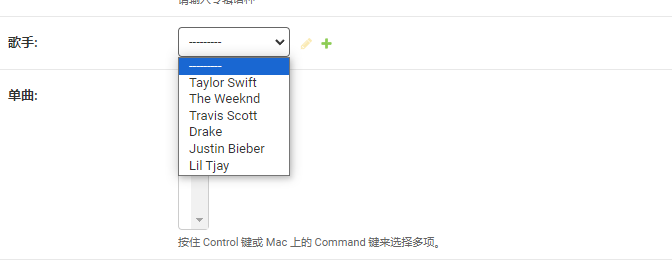

#### **设置歌曲时长**

歌曲时长的值从输入框填写改为后台设置为读取歌曲文件获取的时长。

##### 安装eyed3库

命令如下：

```
pip install eyed3
```

##### 获取mp3时长

内容如下：

```python
import eyed3
 
 
def get_duration_mp3(file_path):
    """ 获取mp3音频文件时长 """
 
    info = eyed3.load(file_path)
    return info.info.time_secs
```

##### 歌曲时长字段修改

修改Singe Model类

首先把歌曲时长字段设置为admin不可改写。

```python
duration = models.IntegerField(editable=False)
```

##### 重写save方法

在重写save方法的内部，需要先调取父类保存方法后文件会被保存到相应路径，

之后才会有文件路径，读取MP3文件获取文件时长后，再存储一次；至于简单的方法因为对django还在学习中，暂时没发现。

```python
def save(self, force_insert=False, force_update=False, using=None,
         update_fields=None):
        """ 重写save方法 处理歌曲时长 """

        if not self.duration: """一定要给duration设置初值！！！排查了一天才发现"""
            self.duration = 0

        super().save()
        path_name = str(self.path.name)
        if path_name.endswith(".mp3"):
            save_path = os.path.join(settings.MEDIA_ROOT, path_name)
            print(save_path)
            self.duration = get_duration_mp3(save_path)
            print(self.duration)
        super().save()
```

#### **增加歌手单曲数量**

需要在增加相应歌手关联单曲时同时增加该歌手的单曲数量。

##### **查询歌手单曲数量**

在musicpage/models.py中新增方法，通过单曲表歌手外键id查询相应歌手拥有单曲数量。

内容如下：

```python
def get_singe_singler_num(singler_id):
    """
    获取单曲表中所属歌手数
    :param singler_id:
    :return:
    """
    return Singe.objects.filter(singler_id=singler_id).count()
```

**同步歌手单曲数量**

单曲保存时处理歌手单曲数量，修改单曲表模型save方法，在最后保存前增加处理。

内容如下：

```python
def save(self, force_insert=False, force_update=False, using=None,
     update_fields=None):
    """ 重写save方法 处理歌曲时长 """

    if not self.duration:
        self.duration = 0

    super().save()
    path_name = str(self.path.name)
    if path_name.endswith(".mp3"):
        save_path = os.path.join(settings.MEDIA_ROOT, path_name)
        self.duration = get_duration_mp3(save_path)
    # 获取相应歌手单曲数
    singe_num = get_singe_singler_num(self.singler_id)
    # 更新相应歌手的单曲数
    Singler.objects.filter(pk=self.singler_id).update(singe_num=singe_num)
    super().save()
```

#### **列表显示**

##### **显示歌手名称**

单曲列表关联歌手外键id，如果需要显示歌手名称，也需要修改否则只显示外键id。

##### **获取歌手名称**

在musicpage/admin.py中设置方法，通过外键id去查询相应歌手信息。

内容如下：

```python
def get_singler_name(id):
    """
    获取歌手名称
    :param id:歌手id
    :return:
    """
    return Singler.objects.get(pk=id)
```

##### **设置歌手名称显示**

修改后台单曲类中外键字段自定义显示处理。

```python
class SingeAdmin(admin.ModelAdmin):
    """ 后台单曲类 """
 
    ......
 
    def get_singler_id(self):
        return get_singler_name(self.singler_id)
 
    get_singler_id.short_description = '歌手'
```

#### **列表显示歌曲时长**

修改后台单曲类，增加显示歌曲时长字段。

```python
def get_duration(self):
    seconds = self.duration
    minutes, seconds = divmod(seconds, 60)
    duration_str = '{:02d}:{:02d}'.format(minutes, seconds)
    return duration_str
get_duration.short_description = '歌曲时长'
 
# 显示字段
list_display = ['id', get_name, get_singler_id, get_duration, get_addtime, get_updatetime]
```

总体效果：

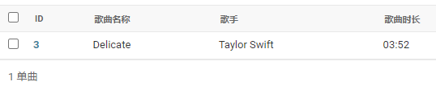

**总结**

对后台单曲模块进行部分功能优化，主要通过新增编辑和列表两方面来进行优化。

### 7. 专辑、首页轮播图原有功能的基础上进行部分功能实现和显示优化

